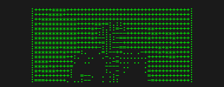

# yt2ascii

Generate ASCII art from YouTube on the Command Line


*Rickroll from the Command Line*

## Features

- Downloads YouTube videos automatically (via yt-dlp)
- Auto-detects the most interesting segment using YouTube's heatmap analysis
- Converts video frames to ASCII art
- Outputs animated GIF with customizable colors
- Play ASCII animation directly in your terminal
- Zero disk space left behind (uses temp files)

## Installation

```bash
pip install .
```

Or for development:

```bash
pip install -e .
```

## Usage

### Basic

```bash
# Generate ASCII GIF (auto-detects interesting moment)
yt2ascii "https://www.youtube.com/watch?v=dQw4w9WgXcQ"

# Specify output file
yt2ascii "https://www.youtube.com/watch?v=dQw4w9WgXcQ" -o rickroll.gif
```

### Play in Terminal

```bash
# Play ASCII animation in terminal after creating GIF
yt2ascii "https://www.youtube.com/watch?v=dQw4w9WgXcQ" --play

# Open GIF in default viewer after creation
yt2ascii "https://www.youtube.com/watch?v=dQw4w9WgXcQ" --open

# Both
yt2ascii "https://www.youtube.com/watch?v=dQw4w9WgXcQ" --play --open
```

### Customization

```bash
# Custom width and duration
yt2ascii "URL" -w 100 -d 5

# Specify exact start time (skip auto-detection)
yt2ascii "URL" --start 30.5

# Custom colors (hex)
yt2ascii "URL" --fg-color "#ff00ff" --bg-color "#000000"

# Adjust frame rate and font size
yt2ascii "URL" -f 15 --font-size 12
```

## Options

| Option | Short | Default | Description |
|--------|-------|---------|-------------|
| `--output` | `-o` | `output.gif` | Output GIF file path |
| `--width` | `-w` | `80` | ASCII art width in characters |
| `--duration` | `-d` | `3.0` | Duration of the GIF in seconds |
| `--fps` | `-f` | `10` | Frames per second |
| `--start` | | auto | Start timestamp in seconds |
| `--font-size` | | `10` | Font size for GIF rendering |
| `--fg-color` | | `#00ff00` | Text color (hex) |
| `--bg-color` | | `#1a1a1a` | Background color (hex) |
| `--play` | | | Play animation in terminal |
| `--open` | | | Open GIF in default viewer |

## How It Works

1. **Download**: Fetches the video in low quality (360p-480p) for speed
2. **Analyze**: Uses YouTube's "Most Replayed" heatmap data to find the most popular segment (falls back to motion detection if unavailable)
3. **Convert**: Extracts frames and maps pixel brightness to ASCII characters (` .:-=+*#%@`)
4. **Render**: Draws ASCII text onto images using a monospace font
5. **Output**: Combines frames into an animated GIF

## Requirements

- Python 3.8+
- Dependencies (installed automatically):
  - yt-dlp
  - opencv-python
  - Pillow
  - numpy
  - click

## License

MIT
